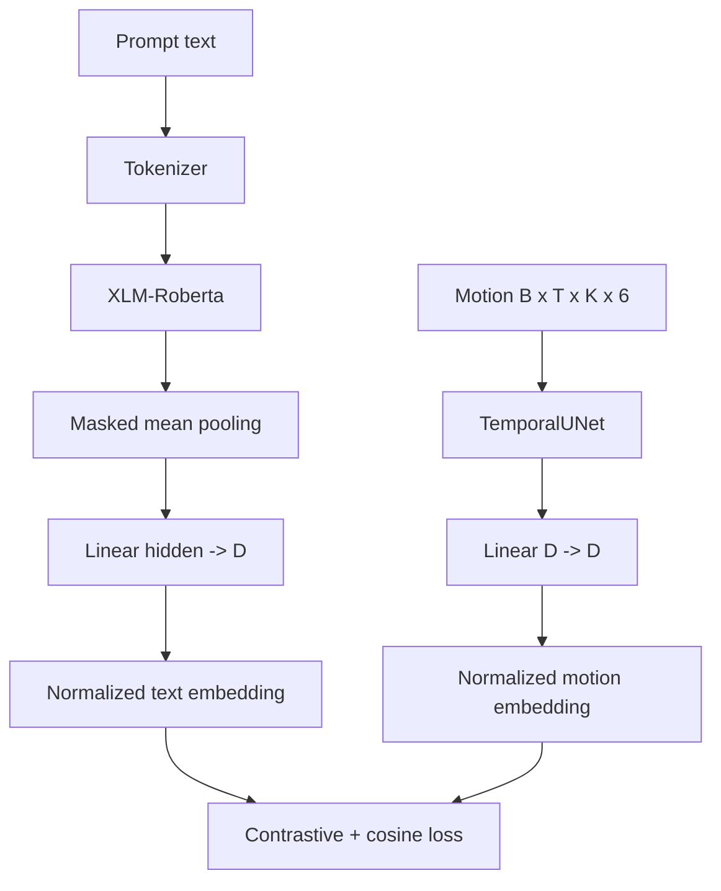

# Architecture: Motion Generation (CLIP + Diffusion)

This document describes the implemented network used for motion generation, plus the CLIP alignment model that provides the frozen text encoder. The goal is to make every layer and reshaping step explicit so you can safely tweak the architecture.

## Config entry points
- `src/configs/network.yaml` (profiles: default, spark, lightweight)
- `src/configs/train_generation.yaml` (training hyperparameters and paths)
- `src/shared/config_loader.py` (YAML to typed config)

### Current values (profile: default)
- Shared embed dim: `128`
- Generation: `num-heads: 4`, `num-layers: 3`, `num-bones: 22`, `diffusion-steps: 100`
- CLIP motion encoder: `motion-num-heads: 4`, `motion-num-layers: 2`

## End-to-end generation flow (training + inference)

```mermaid
graph TD
  subgraph Inputs
    prompt[Prompt text]
    tag[Tag optional]
    t[Timestep]
    clean[Clean motion B x T x K x 6]
    noise[Gaussian noise]
  end

  prompt --> tok[Tokenizer]
  tok --> xlmr[XLM-Roberta (frozen)]
  xlmr --> textproj[Linear hidden -> D]
  textproj --> textemb[Text embedding B x D]

  clean --> qsample[DDIM q_sample]
  noise --> qsample
  qsample --> motion[Noisy motion B x T x K x 6]

  motion --> flat[Flatten K*6]
  flat --> motionproj[Linear K*6 -> D]
  motionproj --> motionh[Motion features B x T x D]

  textemb --> den_textproj[Linear D -> D]
  den_textproj --> textexp[Expand to B x T x D]

  motionh --> add
  textexp --> add[Add]
  add --> h0[h0 B x T x D]

  t --> timestep[TimestepEmbedding -> D]
  tag --> tagemb[TagEmbedding -> D]
  timestep --> condcat
  tagemb --> condcat[Concat -> 2D]

  h0 --> denoiser[DenoiserBlock x L]
  condcat --> denoiser
  denoiser --> outnorm[LayerNorm]
  outnorm --> outproj[Linear D -> K*6]
  outproj --> noisehat[Predicted noise B x T x K x 6]

  noisehat --> loss[MSE vs injected noise]

  subgraph Inference (after denoising loop)
    noisehat -.-> ddimstep[DDIM step]
    ddimstep -.-> smooth[Smoothing Conv1D]
    smooth -.-> quat[6D -> Quaternion]
    quat -.-> velreg[Velocity clamp optional]
    velreg -.-> output[Output B x T x K x 4]
  end
```

Notes:
- The denoiser is the trainable network. DDIM is the scheduler/math for diffusion steps, not a neural layer.
- Post-processing (smoothing, 6D->quat, velocity clamp) happens in inference only.

## DenoiserBlock (layer-by-layer)

```mermaid
graph TD
  x[Input h B x T x D] --> temporal[TemporalLayer (self-attn + FFN)]
  temporal --> film[FiLM cond]
  film --> rope[RoPE]
  rope --> norm[LayerNorm]
  norm --> mha[MultiHeadAttention]
  mha --> add[Residual add]
  add --> adaln[AdaLN cond]
  adaln --> transform[TransformLayer (FFN + optional residual)]
  transform --> y[Output h']
```

## CLIP alignment network (training CLIP only)
The generation model reuses the frozen XLM-R text encoder from this CLIP model. The motion encoder below is not used during generation training.



## Generation network: layer-by-layer walkthrough
Symbols: B=batch, T=frames, K=bones, C=channels(6), D=embed dim, L=num layers, H=num heads.

1) Inputs
- Text: `input_ids, attention_mask` -> XLM-R -> pooled -> `textEmb (B x D)`
- Motion: `noisyMotion (B x T x K x 6)`
- Tags: list of length B (optional)
- Timesteps: `t (B)`

2) MotionDenoiser input projections
- Flatten motion: `noisyMotion -> (B x T x (K*6))`
- `motionProj`: Linear `(K*6 -> D)` => `motionH (B x T x D)`
- `textProj`: Linear `(D -> D)` then expand to `textH (B x T x D)`
- Add: `h0 = motionH + textH`

3) Conditioning
- `timestepEmbed`: sinusoidal + MLP -> `(B x D)`
- `tagEmbed`: learnable -> `(B x D)` (default embedding if tag is None)
- Concatenate: `cond (B x 2D)`

4) Denoiser blocks (repeat L times)
- `TemporalLayer`: Transformer encoder layer over time (optional mask)
- `FiLM`: feature-wise affine modulation by `cond`
- `RoPE`: rotary positional encoding over time
- `MultiHeadAttention`: custom MHA over time with residual add
- `AdaLN`: adaptive layer norm modulated by `cond`
- `TransformLayer`: FFN, residual if input/output dims match

5) Output projection
- `LayerNorm` -> `Linear (D -> K*6)` -> reshape to `(B x T x K x 6)`

6) Training loss
- Loss used in generation training: MSE on predicted noise vs injected noise.
- Other losses exist in `src/shared/model/generation/losses.py` but are not used in the current training loop.

7) Inference post-processing
- Smoothing: depthwise Conv1D on `(B x T x (K*6))`
- 6D -> rotation matrix -> quaternion `(B x T x K x 4)`
- Optional velocity clamp (no-op by default)

## Parameter tables

### Global config and symbols
| Symbol | Meaning | Source | Notes |
| --- | --- | --- | --- |
| D | Embed dim | `network.yaml: embed-dim` | Shared by CLIP + generation |
| H | Num heads | `generation.num-heads` | Must divide D |
| L | Num denoiser blocks | `generation.num-layers` | Denoiser stack depth |
| K | Num bones | `generation.num-bones` | Must match dataset |
| C | Motion channels | `MotionDenoiser.motionChannels` | Default `6` for 6D rotations |
| S | Diffusion steps | `generation.diffusion-steps` | Training + DDIM sampling |

### CLIP text encoder path (frozen during generation)
| Module | Parameters | Input -> Output | Notes |
| --- | --- | --- | --- |
| XLM-Roberta | `hidden_size` | tokens -> `B x T_text x H_text` | From HF model config |
| Masked mean | N/A | `B x T_text x H_text` -> `B x H_text` | Uses attention mask |
| `textProj` | Linear `H_text -> D` | `B x H_text` -> `B x D` | Shared embed space |

### TemporalUNet (CLIP motion encoder, training only)
| Module | Parameters | Input -> Output | Notes |
| --- | --- | --- | --- |
| Input projection | Linear `K*C -> D` | `B x T x (K*C)` -> `B x T x D` | Flattens bones/channels |
| Temporal conv | Stride 4 + stride 2 | `B x D x T` -> `B x D x T'` | Downsamples time |
| Positional encoding | Sinusoidal | `B x T' x D` -> `B x T' x D` | Added to features |
| Transformer | `numLayers`, `numHeads` | `B x T' x D` -> `B x T' x D` | FFN dim = `2D` |
| Output proj | Linear `D -> D` | `B x D` -> `B x D` | After mean pooling |

### MotionDenoiser (generation)
| Module | Parameters | Input -> Output | Notes |
| --- | --- | --- | --- |
| `motionProj` | Linear `K*C -> D` | `B x T x (K*C)` -> `B x T x D` | Flattens motion |
| `textProj` | Linear `D -> D` | `B x D` -> `B x D` | Expanded across T |
| `timestepEmbed` | MLP `D -> 4D -> D` | `B` -> `B x D` | Sinusoidal + MLP |
| `tagEmbed` | Embedding `numTags+1 -> D` | `B` -> `B x D` | Default for None |
| Blocks | `L` x DenoiserBlock | `B x T x D` -> `B x T x D` | Conditioning via FiLM + AdaLN |
| `outputProj` | Linear `D -> K*C` | `B x T x D` -> `B x T x (K*C)` | Reshaped to motion |

### DenoiserBlock details
| Layer | Parameters | Input -> Output | Notes |
| --- | --- | --- | --- |
| TemporalLayer | MHA + FFN | `B x T x D` -> `B x T x D` | FFN dim = `4D` |
| FiLM | Linear `2D -> 2D` | `B x T x D` -> `B x T x D` | Conditioned on tag+timestep |
| RoPE | N/A | `B x T x D` -> `B x T x D` | Rotary positional encoding |
| MHA | `D, H` | `B x T x D` -> `B x T x D` | Residual add |
| AdaLN | Linear `2D -> 2D` | `B x T x D` -> `B x T x D` | Conditioned on tag+timestep |
| TransformLayer | FFN `D -> 4D -> D` | `B x T x D` -> `B x T x D` | Residual if dims match |

### Post-processing (inference)
| Module | Parameters | Input -> Output | Notes |
| --- | --- | --- | --- |
| Smoothing | Depthwise Conv1D | `B x T x (K*C)` -> `B x T x (K*C)` | Kernel size = 3 by default |
| Renormalization | 6D -> rotation matrix | `B x T x K x 6` -> `B x T x K x 3 x 3` | Gram-Schmidt |
| Quaternion | Rotation matrix -> quat | `B x T x K x 3 x 3` -> `B x T x K x 4` | In `MotionGenerator` |
| Velocity clamp | Optional | `B x T x K x 4` -> `B x T x K x 4` | No-op if maxVelocity None |

## Tuning and reshaping knobs

### In config (most common)
- `src/configs/network.yaml`:
  - `embed-dim` (shared by CLIP + generation)
  - `generation.num-heads`, `generation.num-layers`
  - `generation.num-bones`, `generation.diffusion-steps`
  - `clip.motion-num-heads`, `clip.motion-num-layers` (CLIP training only)

### In code (requires edits)
- `src/shared/model/generation/denoiser.py`:
  - `motionChannels` (channels per bone, default 6 for 6D rotations), `dropout`, block composition
- `src/shared/model/generation/motion_generator.py`:
  - `smoothingKernel`, `maxVelocity`, DDIM step logic
- `src/shared/model/clip/core.py` and `src/shared/model/layers/temporal_unet.py`:
  - TemporalUNet depth, downsampling, `maxFrames`

## Constraints to respect when reshaping
- `embedDim` must be divisible by `numHeads` (assert in `MultiHeadAttention`).
- `embedDim` must match between CLIP text encoder output projection and generation denoiser input projection.
- `numBones` must match your dataset and also the CLIP motion encoder if you train CLIP.
- `motionChannels` is assumed to be 6 everywhere (flattening, smoothing, output projection).
- Changing `diffusionSteps` affects both training noise schedule and inference DDIM sampling.

## Shape-check CLI
- Fast shape check (denoiser + post-processing):  
  `poetry run python -m src.cli.tools shape-check --network-profile default`
- Full shape check (includes CLIP + quaternion conversion):  
  `poetry run python -m src.cli.tools shape-check --full --device cpu`
Notes:
- Full check assumes `motionChannels=6` (6D rotations).
- Fast check skips renormalization if `motionChannels != 6`.
